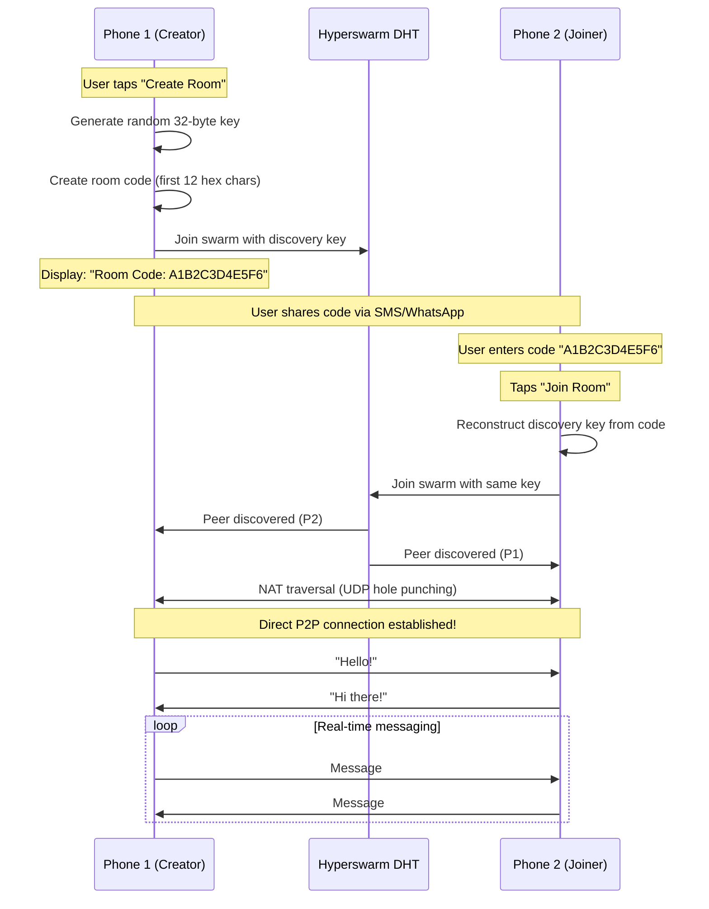

# Phone-to-Phone P2P Connection Flow

## Visual Connection Process



## Detailed Step-by-Step Flow

### Phase 1: Room Creation (Phone 1)

```
┌─────────────────────────────────────────────────────┐
│ PHONE 1: CREATE ROOM                                │
├─────────────────────────────────────────────────────┤
│                                                     │
│ 1. User taps "Create Room"                         │
│    ↓                                                │
│ 2. Backend generates:                              │
│    discoveryKey = crypto.randomBytes(32)           │
│    // e.g., a1b2c3d4e5f6...                        │
│    ↓                                                │
│ 3. Create simple room code:                        │
│    roomCode = discoveryKey.hex().substring(0, 12)  │
│    // "A1B2C3D4E5F6"                               │
│    ↓                                                │
│ 4. Join Hyperswarm:                                │
│    swarm.join(discoveryKey, {                      │
│      server: true,  // Accept connections          │
│      client: true   // Make connections            │
│    })                                              │
│    ↓                                                │
│ 5. Send room code to frontend via RPC              │
│    ↓                                                │
│ 6. Frontend displays:                              │
│    "Room Code: A1B2C3D4E5F6"                       │
│    [Copy to Clipboard] button                      │
│    ↓                                                │
│ 7. Status: "Waiting for peer..."                   │
│                                                     │
└─────────────────────────────────────────────────────┘
```

### Phase 2: Room Joining (Phone 2)

```
┌─────────────────────────────────────────────────────┐
│ PHONE 2: JOIN ROOM                                  │
├─────────────────────────────────────────────────────┤
│                                                     │
│ 1. User receives "A1B2C3D4E5F6" from Phone 1       │
│    ↓                                                │
│ 2. User enters code in app                         │
│    ↓                                                │
│ 3. User taps "Join Room"                           │
│    ↓                                                │
│ 4. Backend reconstructs discovery key:             │
│    fullHex = roomCode.padEnd(64, '0')              │
│    // "a1b2c3d4e5f6000...000"                      │
│    discoveryKey = Buffer.from(fullHex, 'hex')      │
│    ↓                                                │
│ 5. Join same Hyperswarm:                           │
│    swarm.join(discoveryKey, {                      │
│      server: true,                                 │
│      client: true                                  │
│    })                                              │
│    ↓                                                │
│ 6. Hyperswarm DHT lookup begins...                 │
│                                                     │
└─────────────────────────────────────────────────────┘
```

### Phase 3: Peer Discovery & Connection

```
┌─────────────────────────────────────────────────────┐
│ HYPERSWARM DHT (Distributed Hash Table)            │
├─────────────────────────────────────────────────────┤
│                                                     │
│ 1. Both phones announce to DHT:                    │
│    "I'm looking for topic: a1b2c3d4..."           │
│    ↓                                                │
│ 2. DHT finds match:                                │
│    "Phone 1 and Phone 2 want same topic!"         │
│    ↓                                                │
│ 3. DHT sends peer info to both:                    │
│    - Phone 1's IP & port                           │
│    - Phone 2's IP & port                           │
│    ↓                                                │
│ 4. NAT Traversal (UDP hole punching):             │
│    Phone 1 ────── attempts ────► Phone 2          │
│    Phone 2 ◄────── attempts ───── Phone 1          │
│    ↓                                                │
│ 5. Direct connection established!                  │
│    Phone 1 ◄═══════════════════► Phone 2          │
│                                                     │
└─────────────────────────────────────────────────────┘
```

### Phase 4: Connected & Messaging

```
┌─────────────────────────────────────────────────────┐
│ CONNECTED STATE                                     │
├─────────────────────────────────────────────────────┤
│                                                     │
│ ┌──────────────┐         ┌──────────────┐          │
│ │  Phone 1     │         │  Phone 2     │          │
│ ├──────────────┤         ├──────────────┤          │
│ │ Status: ●    │◄═══════►│ Status: ●    │          │
│ │ Connected    │         │ Connected    │          │
│ └──────────────┘         └──────────────┘          │
│                                                     │
│ Message Flow:                                       │
│                                                     │
│ Phone 1 sends "Hello":                             │
│   1. User types message                            │
│   2. Frontend → RPC → Backend                      │
│   3. Backend: conn.write("Hello")                  │
│   4. Direct to Phone 2                             │
│   5. Phone 2 backend: conn.on('data')              │
│   6. Backend → RPC → Frontend                      │
│   7. Display in chat                               │
│                                                     │
│ Phone 2 sends "Hi!":                               │
│   (Same process in reverse)                        │
│                                                     │
└─────────────────────────────────────────────────────┘
```

## Network Topology

### NAT Traversal Example

```
      Internet
         │
         │
    [Hyperswarm DHT]
         │
         │
    ┌────┴────┐
    │         │
  [NAT]     [NAT]
    │         │
    │         │
[Phone 1]  [Phone 2]

Step 1: Both phones behind NAT/firewall
Step 2: Both connect to public DHT nodes
Step 3: DHT coordinates hole punching
Step 4: Direct UDP connection formed
```

### Direct Connection (After NAT Traversal)

```
[Phone 1] ◄════ Direct P2P Stream ════► [Phone 2]
   │                                        │
   └── No middleman servers needed! ───────┘
```

## Discovery Key System

### How Room Codes Work

```javascript
// Phone 1 (Creator):
const discoveryKey = crypto.randomBytes(32)
// Full key:
// a1b2c3d4e5f67890abcdef1234567890abcdef1234567890abcdef1234567890

// Room code (first 12 chars):
const roomCode = "A1B2C3D4E5F6"

// Phone 2 (Joiner):
// User enters: "A1B2C3D4E5F6"
// Reconstruct full key:
const fullHex = "a1b2c3d4e5f6" + "0".repeat(52)
// a1b2c3d4e5f60000000000000000000000000000000000000000000000000000
const discoveryKey = Buffer.from(fullHex, 'hex')

// Both end up with keys that hash to same DHT topic!
```

## RPC Communication Flow

```
┌───────────────────┐         ┌───────────────────┐
│   Frontend        │         │   Backend         │
│   (React Native)  │         │   (Bare Worklet)  │
└───────────────────┘         └───────────────────┘
         │                              │
         │  1. Start worklet            │
         │  with mode + roomCode        │
         ├─────────────────────────────►│
         │                              │
         │                              │ 2. Join swarm
         │                              │
         │  3. RPC_ROOM_CODE            │
         │◄─────────────────────────────┤
         │  (send room code)            │
         │                              │
         │                              │ 4. Peer connects
         │                              │
         │  5. RPC_CONNECTED            │
         │◄─────────────────────────────┤
         │                              │
         │  6. User types message       │
         │                              │
         │  7. RPC_MESSAGE              │
         ├─────────────────────────────►│
         │                              │ 8. Send to peer
         │                              │
         │                              │ 9. Receive from peer
         │                              │
         │  10. RPC_MESSAGE             │
         │◄─────────────────────────────┤
         │  (display message)           │
         │                              │
```

## Security Considerations

### Current Implementation
```
Discovery Key: Shared secret
├─ 32 bytes (256 bits)
├─ Room code: First 12 hex chars (48 bits)
└─ Security: Obscurity-based (not cryptographic)
```

### Threat Model
- ✅ **Prevents:** Casual eavesdropping (need room code)
- ⚠️ **Vulnerable to:** Anyone with room code can join
- ❌ **No encryption:** Messages sent in plaintext over connection
- ❌ **No authentication:** Can't verify peer identity

### Future Enhancements
```
Discovery Key + Encryption + Authentication
├─ Use full 256-bit discovery key
├─ Add Noise Protocol for encryption
├─ Add public key authentication
└─ End-to-end encrypted messaging
```

## Performance Characteristics

### Connection Time
```
Typical P2P Connection Timeline:
├─ DHT Lookup:          200-1000ms
├─ NAT Traversal:       500-5000ms
├─ Connection Established: ~1-10 seconds
└─ Message Latency:     10-100ms (after connection)
```

### Scalability
```
Current (1-to-1):
  Phone 1 ◄───► Phone 2
  - Single connection
  - Low overhead

Possible (1-to-many):
  Phone 1 ◄───► Phone 2
     │
     └─────────► Phone 3
     └─────────► Phone 4
  - Multiple connections
  - Higher overhead per peer
```

---

**This P2P architecture enables direct phone-to-phone communication with no servers, using the power of Hyperswarm's DHT and NAT traversal!** 🍐
